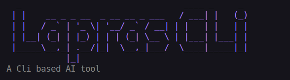
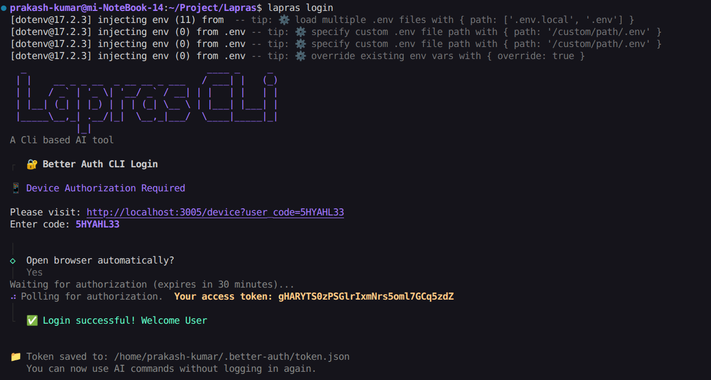
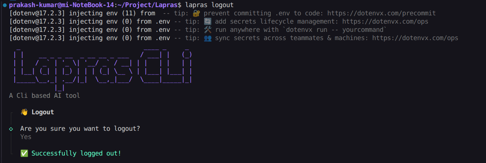
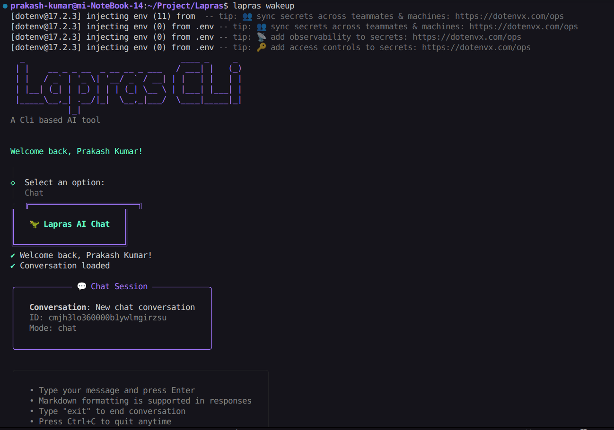
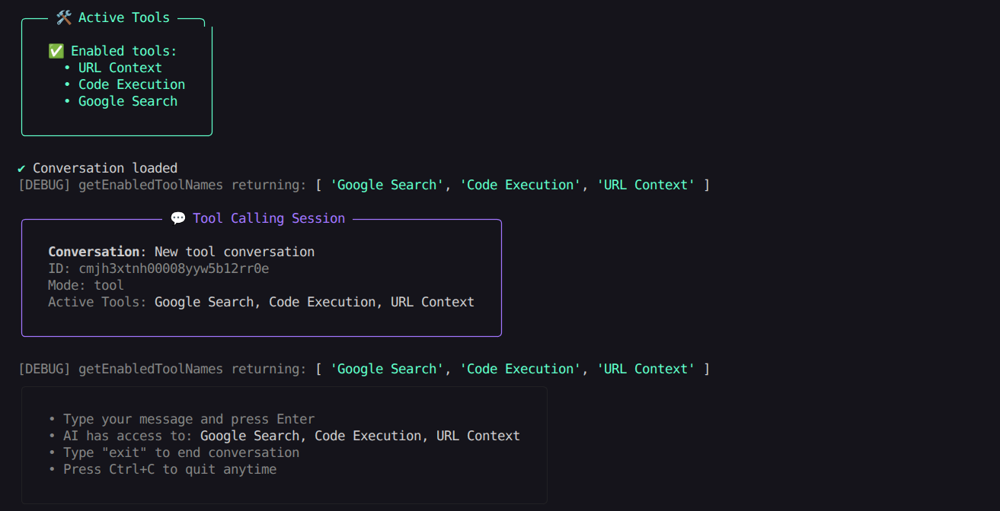
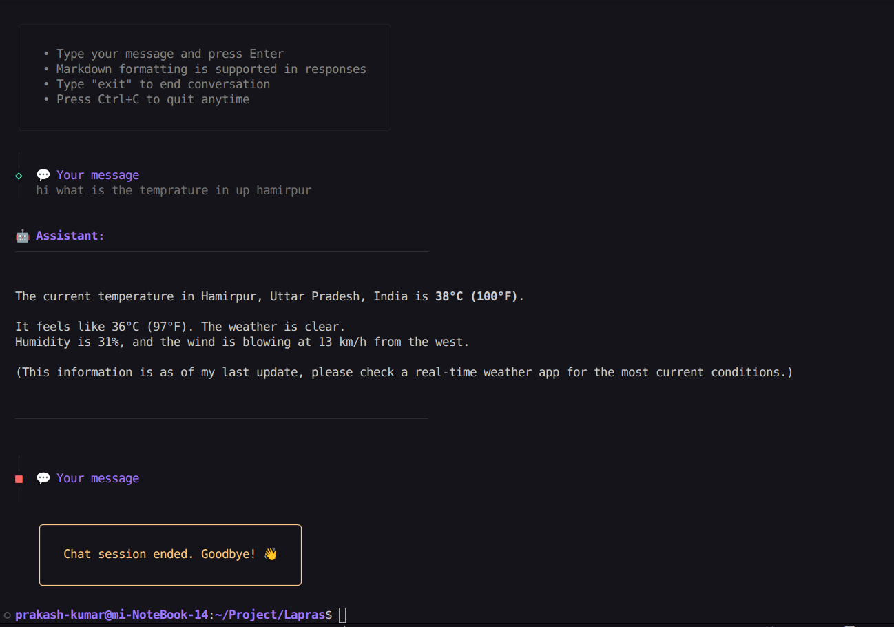
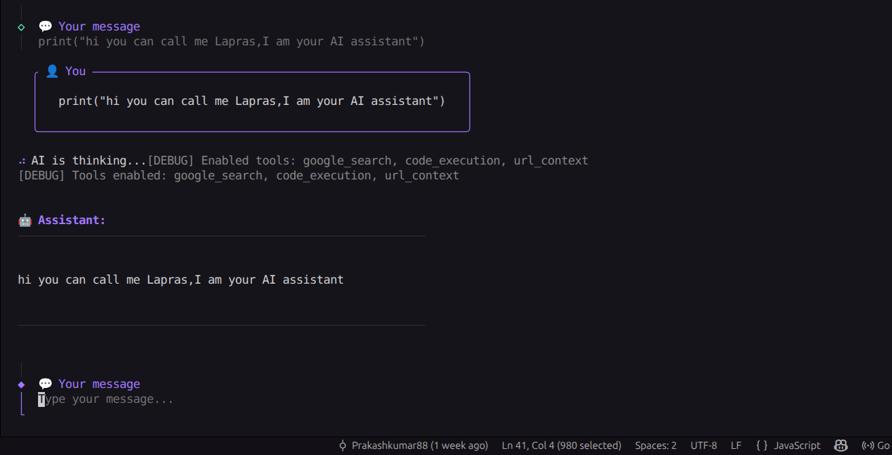
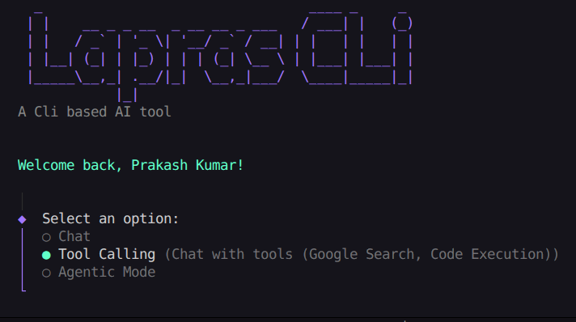
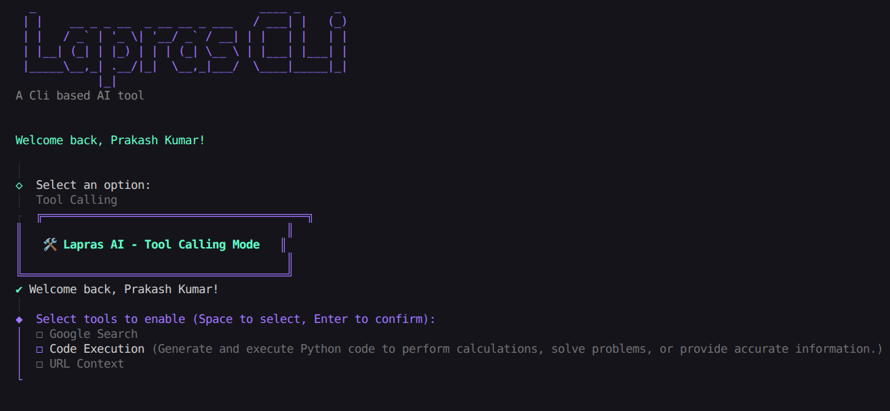

---
# 🧠 Lapras CLI — AI-Powered Command Line Assistant

🦖 Lapras CLI is a **developer-focused AI assistant for the terminal**.
It combines conversational AI, tool calling, code execution, and secure authentication into a single CLI workflow.

Built to explore how modern AI agents can **reason, use tools, and interact securely from the command line**.

---

```md

```

## ✨ Features

* 💬 **AI Chat Mode**

  * Natural language conversations directly in the terminal
  * Markdown-formatted responses
  * Clean session handling

* 🛠️ **Tool Calling Mode**

  * AI can dynamically use tools during conversation
  * Currently supported:

    * 🔍 Google Search
    * 🧮 Code Execution (Python)
    * 🌐 URL Context

* 🔐 **Secure Authentication (Device Flow)**

  * OAuth-style device authorization
  * No browser tokens stored in CLI
  * Access tokens securely saved locally

* 🤖 **Agentic Workflow (Extensible)**

  * Designed to support autonomous multi-step reasoning
  * Clear separation between chat, tools, and execution layers

* 🎨 **Polished CLI UX**

  * Interactive prompts
  * ASCII branding
  * Colorized output
  * Session status indicators

---

## 📸 Demo & Screenshots

> Screenshots below show real terminal sessions using Lapras CLI.

```md






```

---

## run locally:

```bash
git clone https://github.com/your-username/lapras-cli.git
cd lapras-cli
npm install
npm link
```

---

## 🧩 Usage

### Wake up Lapras

```bash
lapras wakeup
```

### Login (Device Authorization Flow)

```bash
lapras login
```

This will:

1. Generate a device code
2. Ask you to open a browser
3. Authenticate securely
4. Save the access token locally

---

### Start Mode

```bash
lapras wakeup
```


You can enable tools like:

* Google Search
* Code Execution
* URL Context



The AI decides **when and how** to use them.

---

### Who Am I?

```bash
lapras whoami
```

### Logout

```bash
lapras logout
```

---

## 🏗️ Architecture Overview

```text
CLI (Node.js)
 ├─ Prompt System (Clack)
 ├─ Auth Layer (Device Flow)
 ├─ AI Orchestration
 │   ├─ Chat Mode
 │   ├─ Tool Calling Mode
 │   └─ Agentic Mode
 ├─ Tool Registry
 │   ├─ Google Search
 │   ├─ Code Execution
 │   └─ URL Context
 └─ Token Storage (~/.better-auth/)
```

---

## 🔐 Authentication Details

* Uses **OAuth-style Device Authorization Flow**
* Designed for both local and deployed backends

---

## 🧪 Example Queries

```text
> hi you can call me Lapras
> what is the temperature in Hamirpur UP?
> write python code to calculate fibonacci
> search latest javascript trends
```

---

## 🛠️ Tech Stack

* **Node.js**
* **Better Auth (Device Flow)**
* **Google Generative AI**
* **Clack Prompts**
* **Chalk & Boxen**
* **Prisma + PostgreSQL (optional backend)**
* **Modular Tool Registry**

---

## 📌 Why This Project Matters

This project demonstrates:

* Real-world **AI agent orchestration**
* Secure **CLI authentication design**
* Tool-augmented LLM workflows
* Production-style CLI UX
* Clean separation of concerns

Built as a learning + experimentation project, with production patterns in mind.

---

## 🧭 Future Improvements

* Persistent chat history
* Plugin system for custom tools
* Streaming responses
* Offline tool simulation
* Configurable agent policies

---

## 👤 Author

**Prakash Kumar**
Computer Science Student | Backend & Systems Enthusiast
Built with curiosity, caffeine, and too many terminal tabs ☕💻

---
